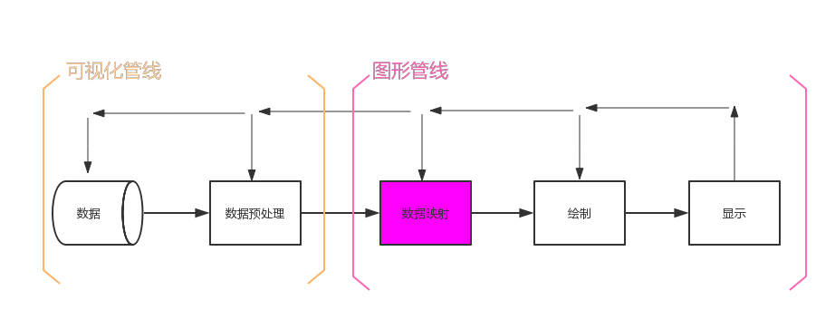
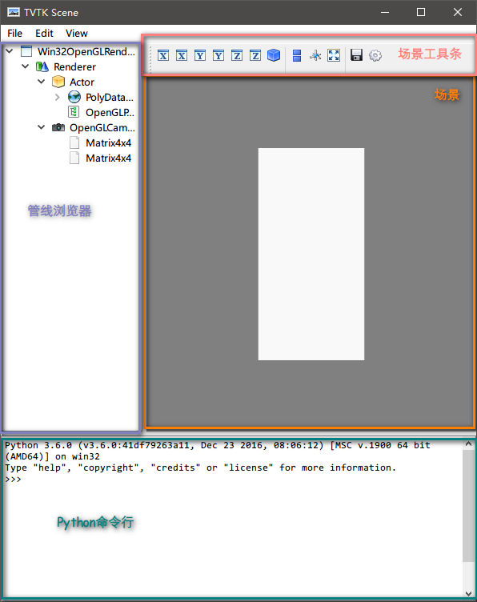

## 管线（Pipeline）


<!-- more -->

```python
from tvtk.api import tvtk
# 可视化管线
# 创建一个长方体数据源 
s = tvtk.CubeSource(x_length=1.0, y_length=2.0, z_length=3.0)
# 将其映射为图形数据 
m = tvtk.PolyDataMapper(input_connection=s.output_port)
# 图形管线
# 创建一个Actor 
a = tvtk.Actor(mapper=m)
# 创建一个Rnderer 
r = tvtk.Renderer(background=(0, 0, 0))
# 将Actor添加到Renderer中 
r.add_actor(a)
# 创建一个窗口 
w = tvtk.RenderWindow(size=(300, 300))
# 将Renderer添加到窗口中 
w.add_renderer(r)
# 添加交互工具 
i = tvtk.RenderWindowInteractor(render_window=w)
# 开启交互 
i.initialize()
i.start()
```
### 可视化管线
将原始数据加工成图形数据的过程

| 属性             | 说明                               |
| -------------- | -------------------------------- |
| CubeSourece    | 通过程序内部计算输出一组描述长方体的数据（PloyData）   |
| PolyDataMapper | PolyData通过该映射器将数据映射为图形数据（mapper） |

### 图形管线
图形数据加工为我们所看到的图像的过程


| 属性                     | 说明                                       |
| ---------------------- | ---------------------------------------- |
| Actor                  | 场景中的一个实体。它包括一个图形数据（mapper），具有描述该实体的位置，方向，大小的属性。 |
| Renderer               | 渲染的场景。它包括多个需要渲染的Actor                    |
| RenderWindow           | 渲染用的图形窗口，它包括一个或者多个Render                 |
| RenderWindowInteractor | 给图形窗口提供一些用户交互功能，例如平移、旋转、放大缩小。这些交互式操作并不改变Actor或者图形数据的属性，只是调整场景中的照相机（Camera）的一些设置。 |

### 观察Tvtk的管线
使用ivtk显示立方体
```python
from tvtk.api import tvtk
from tvtk.tools import ivtk
from pyface.api import GUI

s = tvtk.CubeSource(x_length=1.0, y_length=2.0, z_length=3.0)
m = tvtk.PolyDataMapper(input_connection=s.output_port)
a = tvtk.Actor(mapper=m)
# 创建一个窗口
gui = GUI()
win = ivtk.IVTKWithCrustAndBrowser()
win.open()
win.scene.add_actor(a)
# 修正窗口显示错误
dialog = win.control.centralWidget().widget(0).widget(0)
from pyface.qt import QtCore
dialog.setWindowFlags(QtCore.Qt.WindowFlags(0x00000000))
dialog.show()
# 开始界面消息循环
gui.start_event_loop()
```



### 照相机属性

| 属性             | 说明                                       |
| -------------- | ---------------------------------------- |
| clipping\_plane | 它有两个元素，分别表示照相机到近、远两个裁剪 平面的距离。在这两个平面范围之外将不会显示 |
| position       | 照相机在三维空间中的坐标                             |
| focal\_point    | 照相机所聚焦的焦点坐标                              |
| view\_up        | 照相机的上方向矢量                                |

## 数据集
- 点（Point）和数据（Data）
- 点之间：连接 VS 非连接
- 多个相关的点组成单元
- 点的连接：显示 VS 隐式

### 数据集的类型

| 数据集             | 点的连接 | 特点                        |
| --------------- | ---- | ------------------------- |
| ImageData       | 隐式   | 二维或三维图像的数据结构              |
| RectilinearGrid | 隐式   | 间距不均匀的网格，所有点都在正交的网格上      |
| StructuredGild  | 隐式   | 创建任意形状的网格，需要指定点的坐标        |
| PolyData        | 显式   | 由一系列的点、点之间的联系以及由点构成的多边形组成 |

## Tvtk库的数据加载
TVTK模型读取
`s = tvtk.STLReader(file_name = "stl文件名")`

TVTK MultiBlock数据读取

- Plot3D
- 网格 (XYZ 文件)
- 空气动力学结果 (Q 文件)
- 通用结果

```python
from tvtk.api import tvtk
 
def read_data():# 读入数据
    plot3d = tvtk.MultiBlockPLOT3DReader(
            xyz_file_name="combxyz.bin",#网格文件
            q_file_name="combq.bin",#空气动力学结果文件
            scalar_function_number=100,#设置标量数据数量
            vector_function_number=200#设置矢量数据数量
            )
    plot3d.update()
    return plot3d
 
plot3d = read_data()
grid = plot3d.output.get_block(0)
```


